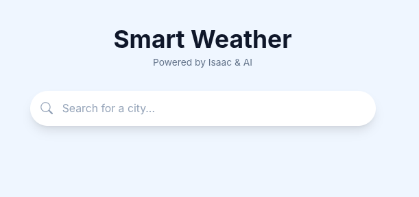
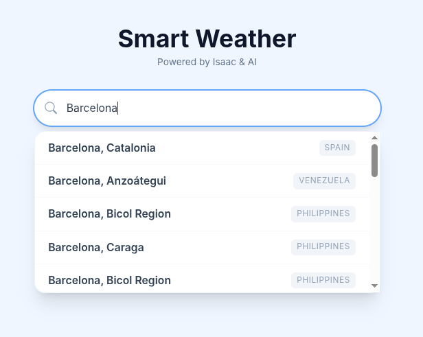
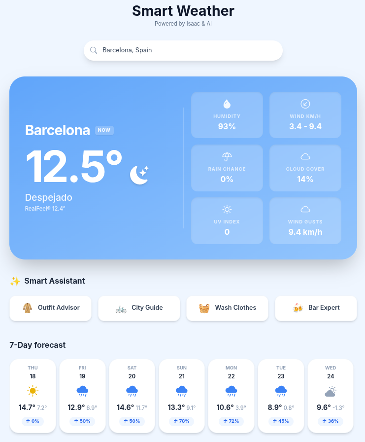
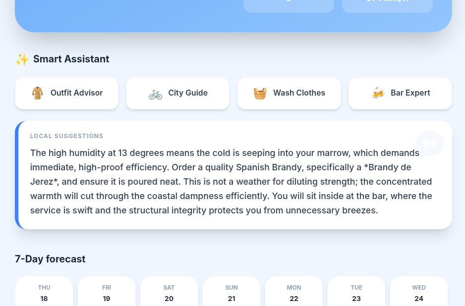

# ☀️ Smart Weather Frontend


Interfaz de usuario moderna y responsiva para la aplicación Smart Weather. Desarrollada en Angular, se conecta con el backend para mostrar el clima y las recomendaciones inteligentes de la IA.

## 📸 Screenshots

Main title and search bar

Cities found according to user input

Weather for selected city

AI suggestion

## 🚀 Características Principales

* **Diseño Responsivo:** Adaptado a móviles y escritorio usando Tailwind CSS.
* **Proxy Inverso:** Configuración avanzada en Netlify para evitar problemas de CORS y ocultar la URL del backend.
* **Manejo de Errores:** Feedback visual cuando el backend está "despertando" (Cold Start).
* **Búsqueda en Tiempo Real:** Interfaz intuitiva para buscar ciudades.
* **Recomendaciones Inteligentes:** IA que sugiere ropa, actividades en la ciudad buscada y recomendaciones basadas en las condiciones actuales.

## 🛠️ Tech Stack

* **Framework:** Angular 16.2.16
* **Estilos:** Tailwind CSS
* **Hosting:** Netlify
* **Control de Versiones:** Git & GitHub

## ⚙️ Instalación y Configuración Local

1.  **Clonar el repositorio:**
    ```bash
    git clone [https://github.com/isaac-diez/weather-app-front.git](https://github.com/isaac-diez/weather-app-front.git)
    cd weather-app-frontend
    ```

2.  **Instalar dependencias:**
    ```bash
    npm install
    ```

3.  **Configurar Environment:**
  * **Local (`src/environments/environment.ts`):**
      ```typescript
      export const environment = {
        production: false,
        apiUrl: 'http://localhost:8080/api'
      };
      ```
  * **Producción (`src/environments/environment.prod.ts`):**
      ```typescript
      export const environment = {
        production: true,
        apiUrl: '/api'
      };
      ```

4.  **Ejecutar:**
    ```bash
    ng serve
    ```
    Navega a `http://localhost:4200/`.

## 🌐 Despliegue y Proxy (Netlify)

Este proyecto utiliza un archivo `netlify.toml` en la raíz para gestionar las redirecciones y el proxy hacia Render.

**Configuración Clave (`netlify.toml`):**
```toml
# Redirección de API al Backend (Evita CORS)
[[redirects]]
  from = "/api/*"
  to = "[https://tu-backend-en-render.onrender.com/api/:splat](https://tu-backend-en-render.onrender.com/api/:splat)"
  status = 200
  force = true

# Redirección SPA (Para que Angular maneje las rutas al recargar)
[[redirects]]
  from = "/*"
  to = "/index.html"
  status = 200
```

## 🤝 Contribución
Las Pull Requests son bienvenidas. Para cambios mayores, por favor abre primero un issue para discutir lo que te gustaría cambiar.
